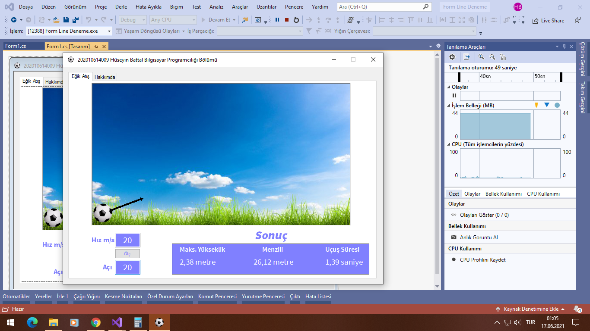

# Egik Atis Uygulamasi

This project is a C# Windows Forms application named **Egik Atis Uygulamasi**. It was developed as part of a university project at Balikesir University. The application simulates the physics of projectile motion, allowing users to input the initial velocity and angle of a projectile to calculate its flight duration, maximum height, and range.

## Features

- **Projectile Motion Simulation**: Calculates the flight duration, maximum height, and range of a projectile based on the initial velocity and angle.
- **Graphical Representation**: The application graphically represents the projectile's path using GDI+ in the form of a curve.
- **User Interface**: Simple and intuitive UI for inputting the initial conditions and displaying the results.

## How It Works

1. **Input**:
    - **Velocity (Vo)**: The initial velocity of the projectile (in m/s).
    - **Angle (Aci)**: The launch angle of the projectile (in degrees).
   
2. **Calculation**:
    - **Maximum Height**: The highest point the projectile reaches.
    - **Flight Duration**: The total time the projectile remains in the air.
    - **Range**: The horizontal distance covered by the projectile.

3. **Graphical Display**: 
    - The path of the projectile is displayed in the application's panel. The graph is scaled based on user input using a trackbar.

## Screenshots



## Getting Started

### Prerequisites

- **Visual Studio**: The project is built using Visual Studio. Make sure you have it installed on your system.

### Installation

1. Clone the repository:
    ```bash
    git clone https://github.com/huseyinbattal3469/egik-atis-uygulamasi.git
    ```
2. Open the solution file (`.sln`) in Visual Studio.
3. Build and run the project.

### Usage

1. Run the application.
2. Enter the initial velocity (in m/s) and the angle (in degrees).
3. Click the "Ölç" button to calculate and display the projectile's flight duration, maximum height, and range.
4. Adjust the trackbar to scale the graphical representation.

## Project Structure

- **Form1.cs**: The main form where the calculations and graphical representations are handled.
- **panel1_Paint**: Handles the drawing of the projectile's trajectory.
- **buttonOlc_Click**: Handles the calculation logic when the user inputs velocity and angle.

## License

This project is licensed under the MIT License.
